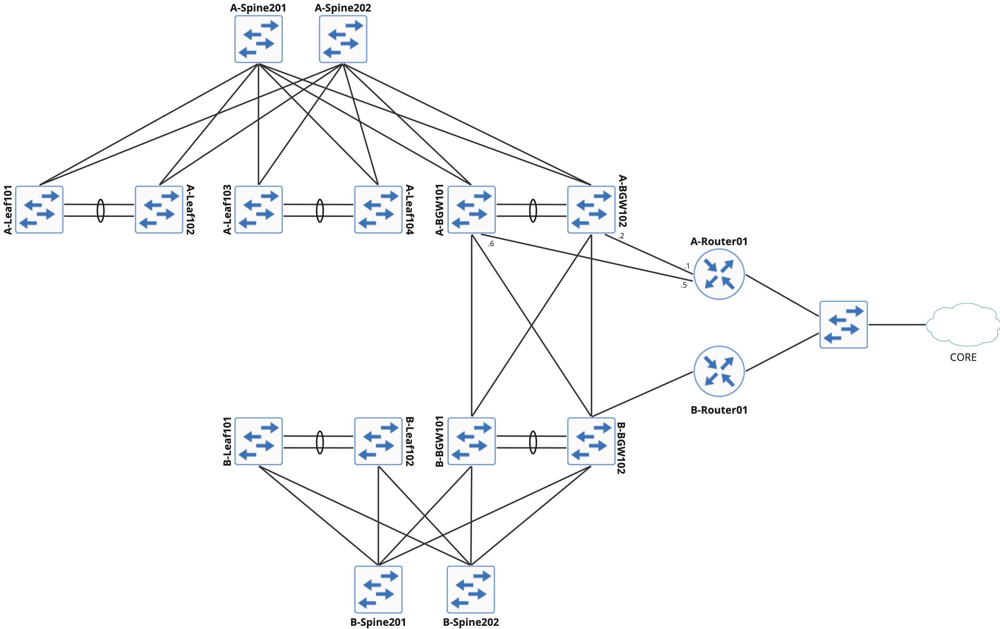

# Cisco Modeling Labs (CML) using Terraform

This repo can be used isolated but also as part of the project NDFC - IaC (under development)

The topology in use here will be of two Datacenters running Nexus 9K and some routers.

